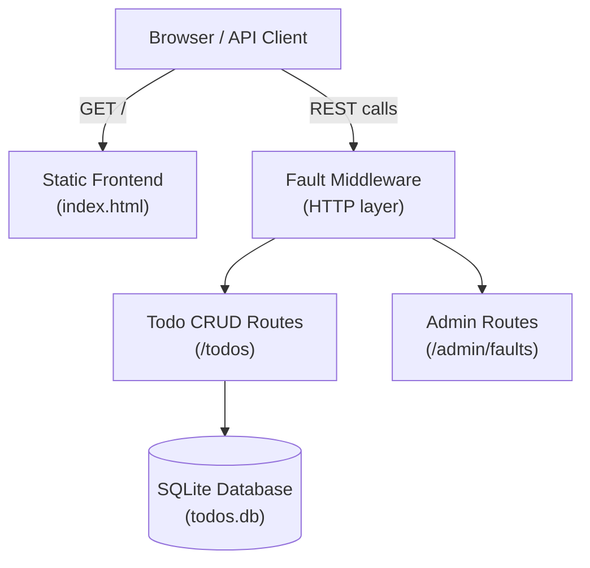

# Architecture

## Components

The application is composed of two primary layers: the **FastAPI backend** and a **SQLite database**.



---

## Request Lifecycle

Every non-admin, non-root request passes through the **fault middleware** before reaching a route handler.

```
Incoming Request
      │
      ▼
┌─────────────────────────┐
│     Fault Middleware     │
│  ┌────────────────────┐ │
│  │ random_500_storm?  │ │  ──► 30% chance → raise ValueError → HTTP 500
│  ├────────────────────┤ │
│  │   memory_leak?     │ │  ──► Append 1 MB to leaked_memory list
│  ├────────────────────┤ │
│  │  latency_spike?    │ │  ──► Sleep 2–5 seconds (async)
│  └────────────────────┘ │
└─────────────────────────┘
      │
      ▼
  Route Handler
      │
      ▼
  SQLite via SQLAlchemy
```

Admin routes (`/admin/*`) and the root (`/`) bypass the fault middleware entirely.

---

## Data Model

### Database Table — `todos`

| Column      | Type    | Constraints              |
|-------------|---------|--------------------------|
| `id`        | Integer | Primary Key, auto-index  |
| `title`     | String  | Indexed                  |
| `completed` | Boolean | Default: `false`         |

### Pydantic Schemas

| Schema         | Used for                        | Fields                          |
|----------------|---------------------------------|---------------------------------|
| `TodoCreate`   | `POST /todos` request body      | `title` (str), `completed` (bool, default `false`) |
| `TodoUpdate`   | `PUT /todos/{id}` request body  | `title` (str, optional), `completed` (bool, optional) |
| `TodoResponse` | All response bodies             | `id` (int), `title` (str), `completed` (bool) |

---

## Database Setup

The app uses **SQLAlchemy 2.x** with a **SQLite** backend (file: `todos.db` inside the container).

- The engine is created from the `DB_PATH` environment variable (default: `sqlite:///./todos.db`).
- Tables are auto-created at startup via `Base.metadata.create_all()`.
- Sessions are provided per-request via the `get_db()` dependency with automatic cleanup.

> **Note:** The `db_connection_leak` fault flag suppresses session closure in `get_db()`, simulating connection exhaustion.

---

## Environment Variables

| Variable                      | Default                        | Description                          |
|-------------------------------|--------------------------------|--------------------------------------|
| `DB_PATH`                     | `sqlite:///./todos.db`         | SQLAlchemy database connection string |
| `OTEL_EXPORTER_OTLP_ENDPOINT` | `http://otel-collector:4317`   | Internal — not required for app use  |
