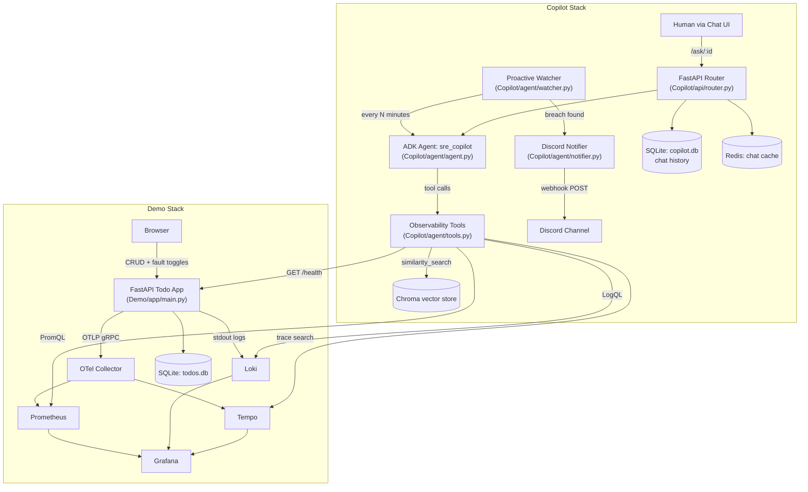

> **Historical document.** This describes the original architecture (Prometheus, Loki, Tempo, Grafana, OTel, Redis, Chroma RAG), which has been replaced by push-based ingest. See `readme.md` and `docs/DESIGN.md` for the current design.

# SRE Copilot (ADK) — Project Overview

> This document is a self-contained technical/functional brief of this repository, written so a fresh Claude Code session (or a new contributor) can understand the system without reading every file first.

## 1. Elevator Pitch

**SRE Copilot** is an AI on-call engineer. It sits next to a running application, continuously watches its telemetry (metrics, logs, traces), and when something breaks it:

1. Detects the breach automatically (no human has to notice first).
2. Performs a full **Root Cause Analysis (RCA)** by querying live observability data with tool calls (not guessing).
3. Pushes the RCA as a rich alert to **Discord**.
4. Also exposes a **chat UI** where a human can ask the same agent ad-hoc questions ("why is `/todos` slow right now?") and get an evidence-backed answer.

It is built on **Google's Agent Development Kit (ADK)** + Gemini, and ships with its own **Demo application** — a deliberately fault-injectable FastAPI "Todo" app — so the whole loop (break something → get paged → get an RCA) can be demonstrated end-to-end with no external dependencies.

This repo is essentially two independently deployable stacks:

| Stack | Folder | Purpose |
|---|---|---|
| **Demo** | `Demo/` | A toy app instrumented with OpenTelemetry, with an admin UI to deliberately inject faults (latency spikes, 500 storms, memory leaks, DB connection leaks). Also runs the full observability backend: Prometheus, Loki, Tempo, Grafana, OTel Collector. |
| **Copilot** | `Copilot/` | The actual SRE agent: FastAPI service wrapping a Google ADK agent, a proactive background watcher, a chat API + frontend, RAG over reference docs, SQLite chat history, and Redis caching. |

They communicate only over HTTP/gRPC (Prometheus/Loki/Tempo query APIs + the Demo app's `/health` endpoint) — the Copilot never touches the Demo app's code or database directly. This means the Copilot pattern is generic: point it at *any* service exposing the same telemetry shape and it works.

## 2. High-Level Architecture



## 3. Repository Layout

```
SRE-Copilot-ADK/
├── Demo/                          # Fault-injectable target application + observability stack
│   ├── app/
│   │   ├── main.py                # FastAPI app: Todo CRUD + /admin/faults + OTel instrumentation
│   │   ├── faults.py               # Fault injection framework (enums, state, apply_faults())
│   │   ├── models.py               # SQLAlchemy model + Pydantic schemas for Todo
│   │   ├── database.py             # SQLAlchemy engine/session setup
│   │   └── static/index.html       # Todo UI + fault-injection admin panel
│   ├── docker-compose.yml          # app, otel-collector, prometheus, loki, tempo, grafana
│   ├── otel-collector-config.yaml
│   ├── prometheus.yml / tempo.yaml
│   ├── grafana/                    # Provisioned datasources + starter dashboard
│   └── docs/                       # architecture.md, api-reference.md, fault-injection.md
│
├── Copilot/                        # The SRE Copilot agent service
│   ├── main.py                     # FastAPI entrypoint: mounts router, starts watcher, serves chat frontend
│   ├── agent/
│   │   ├── agent.py                 # ADK `root_agent` definition + system prompt (RCA format, tool-use rules)
│   │   ├── tools.py                  # Agent tools: get_error_rate, get_latency, get_recent_logs,
│   │   │                             #   get_slow_traces, get_service_health, search_docs (RAG), initialize_rag
│   │   ├── watcher.py                # Background asyncio loop: poll → evaluate thresholds → RCA → Discord
│   │   ├── notifier.py               # Discord webhook embed builder/sender
│   │   ├── thresholds.py             # WatcherThresholds dataclass (env-driven alert thresholds)
│   │   └── config.py                 # Centralised env config (service URLs, Discord webhook, etc.)
│   ├── api/
│   │   ├── router.py                 # /chats, /chat/new, /chat/{id}, /ask/{id}, rename, delete
│   │   └── schema.py                 # Pydantic request/response models
│   ├── db/
│   │   ├── database.py               # SQLite (chats/messages tables) — chat history persistence
│   │   └── redis_client.py           # SafeRedis wrapper (graceful fallback if Redis unreachable)
│   ├── data/
│   │   ├── reference_docs/           # Markdown docs ingested into the RAG vector store
│   │   ├── chroma_store/             # Persisted Chroma vector DB (built at startup from reference_docs/ + README)
│   │   └── copilot.db                # SQLite chat history
│   ├── frontend/index.html           # Chat UI (talks to api/router.py)
│   ├── docker-compose.yml            # copilot + redis services
│   ├── Dockerfile
│   ├── pyproject.toml / requirements.txt
│   └── .env.example
│
├── Claude outputs/                  # Earlier collateral (removed from the repo) (one-pagers, technical brief PDFs, draft reply)
└── readme.md                        # Top-level setup instructions
```

## 4. Tech Stack

| Layer | Technology |
|---|---|
| Agent framework | **Google ADK** (`google-adk`) — `Agent`, `Runner`, `InMemorySessionService` |
| LLM | Google Gemini (`GEMINI_MODEL`, default `gemini-3.5-flash-lite`) via `GOOGLE_API_KEY` |
| Backend (Copilot) | FastAPI + Uvicorn |
| Backend (Demo) | FastAPI + SQLAlchemy + SQLite |
| Metrics | Prometheus (scraped via OTel Collector) |
| Logs | Grafana Loki (LogQL) |
| Traces | Grafana Tempo |
| Visualization | Grafana (auto-provisioned datasources + starter dashboard) |
| Instrumentation | OpenTelemetry SDK (traces, metrics, logs) + OTLP gRPC exporter |
| RAG / vector store | Chroma (`langchain-chroma`) + `GoogleGenerativeAIEmbeddings` (`gemini-embedding-2`), chunked via `langchain-text-splitters` |
| Chat persistence | SQLite (`copilot.db`) — chats + messages tables |
| Caching | Redis (best-effort — chat response cache, 1h TTL, fails open) |
| Notifications | Discord incoming webhooks (rich embeds) |
| Containerization | Docker Compose (two separate compose files — Demo stack and Copilot stack — networked via `host.docker.internal`) |
| Frontend | Static HTML/JS (no framework) — one for the Todo/fault-admin UI, one for the Copilot chat UI |

## 5. The Demo Application (`Demo/`)

A minimal Todo REST API (`GET/POST/PUT/DELETE /todos`) whose real purpose is to be a **controllable incident generator**.

### Fault Injection Model (`Demo/app/faults.py`)
- Faults are **per-route** (`get_todos`, `post_todos`, `put_todo`, `delete_todo`) and **per-fault-type**, toggled independently.
- Applied *inside* the route handler (after the OTel span opens) via `apply_faults(route_key)`, so induced latency/errors are correctly attributed in traces/metrics to that specific endpoint.
- Fault types (`FaultName` enum):
  - `latency_spike` — sleeps 2–5s before the DB call.
  - `random_500_storm` — raises an unhandled `ValueError` on ~30% of calls.
  - `memory_leak` — appends 1MB to an in-process list per call (never freed until disabled).
  - `db_connection_leak` — skips `db.close()`, simulating connection-pool exhaustion.
- Admin API: `GET /admin/faults` (current state) and `POST /admin/faults/{route_key}/{fault_name}?enabled=true|false`. There's also a browser admin panel at `/admin/faults` in `static/index.html` referenced by the top-level README (fault toggles + Todo UI).
- A Prometheus up/down counter (`todo_faults_active`) tracks how many faults are currently enabled.

### Observability wiring
- OpenTelemetry `TracerProvider`/`MeterProvider` configured in `main.py`, exporting to an **OTel Collector** over OTLP gRPC (default `http://otel-collector:4317`).
- `FastAPIInstrumentor` auto-instruments all routes; `LoggingInstrumentor` attaches trace context to log lines.
- Custom metric: `request_outcomes_total{http_route, outcome}` — this is the exact metric the Copilot's `get_error_rate` tool queries.
- Standard OTel HTTP server duration histogram (`http_server_duration_milliseconds_bucket`) — queried by `get_latency`.
- Service name resource attribute: `todo-app` (must match `APP_SERVICE_NAME` in the Copilot's config for tools to find the right data).

## 6. The Copilot Agent (`Copilot/`)

### 6.1 The ADK Agent (`agent/agent.py`)
- `root_agent` is a single Google ADK `Agent` (`gemini-3.5-flash-lite` by default) named `sre_copilot`.
- System prompt enforces:
  1. **Always call tools first** — never answer observability questions from assumptions.
  2. A fixed RCA structure: **Symptom → Evidence → Code locus → Root cause → Implementation recommendation**.
  3. Parallel tool calls (all telemetry tools in one turn) to minimize latency.
  4. Citing the reference-doc source file when `search_docs` (RAG) informs a recommendation.
  5. No hallucinated metrics/logs/trace IDs; if a tool fails, say so and continue.

### 6.2 Tools (`agent/tools.py`)
| Tool | Backend | What it returns |
|---|---|---|
| `get_error_rate(minutes)` | Prometheus | Per-route error % using `increase()` over the window (not cumulative all-time counters) |
| `get_latency(minutes)` | Prometheus | Per-route p95 latency via `histogram_quantile`; also recovers latency for routes with a missing/blank `http_route` label (excluding true 404/405 noise) |
| `get_recent_logs(keyword, limit, minutes)` | Loki | Raw log lines matching a LogQL keyword filter, JSON-unwrapped if the log body is JSON |
| `get_slow_traces(threshold_ms, minutes)` | Tempo | Trace samples exceeding a duration threshold, scoped to the lookback window |
| `get_service_health()` | Demo app `/health` | up/degraded/down + HTTP status |
| `search_docs(query)` | Chroma (RAG) | Top-5 semantically similar chunks from `data/reference_docs/*.md` + root `README.md` |
| `initialize_rag()` | — | One-time startup job: chunks all markdown docs (header-aware split + recursive char split, 500/50) and embeds them into Chroma. Skips if the store directory already exists. |

All tools return plain dicts (JSON-serializable) and **never raise** — errors are caught and returned as `{"error": ..., "source": ...}` so the agent can gracefully report partial data.

### 6.3 Proactive Watcher (`agent/watcher.py`)
An `asyncio` background task (started in FastAPI's `lifespan`) that runs forever:

1. Every `WATCHER_INTERVAL_MINUTES` (default 5, demo uses 1), fetch health + error rate + latency + slow traces + logs **in parallel** (`asyncio.gather`, blocking httpx calls run in an executor).
2. `_evaluate()` compares the results against `WatcherThresholds` and produces a list of human-readable breach strings (service down, error rate over threshold per route, p95 latency over threshold per route, too many slow traces, log keyword matches).
3. If **any** breach is found, it builds a telemetry summary and invokes the **same ADK agent** (via a fresh `Runner`/session) with a "PROACTIVE ALERT" prompt asking for a full RCA.
4. The RCA text + breach list are sent to Discord via `notifier.send_discord_alert`.
5. Never crashes the loop — all exceptions per cycle are logged and it continues on the next interval.

### 6.4 Thresholds (`agent/thresholds.py`)
All env-driven (`WatcherThresholds` dataclass): `error_rate_pct` (default 10%), `latency_p95_ms` (default 500ms), `slow_trace_count`/`slow_trace_min_ms`, `log_keywords` (`ERROR,CRITICAL,Exception,Traceback`), `log_scan_limit`.

### 6.5 Discord Notifier (`agent/notifier.py`)
- Builds a rich Discord embed: color-coded by severity (red = down/health, orange = error rate/latency, yellow = other), breach list field, RCA text chunked across multiple fields (Discord's 1024-char field limit), and a footer with service/window/timestamp.
- No-ops gracefully (returns `False`, logs a warning) if `DISCORD_WEBHOOK_URL` is unset.

### 6.6 Chat API (`api/router.py` + `api/schema.py`)
REST endpoints backing the chat frontend:
- `GET /chats` — list all conversations.
- `POST /chat/new` — create a chat (default title "New Chat").
- `GET /chat/{id}` — fetch a chat + its messages (Redis-cached, 1h TTL, SQLite fallback).
- `POST /ask/{id}` — send a user message, run it through the ADK `Runner`, persist both user + agent messages, auto-title the chat from the first message, track `llm_calls` count.
- `PUT /chat/{id}/rename`, `DELETE /chat/{id}`.
- Each chat maps to its own ADK session (`session_id = f"chat-{id}"`), so conversation context persists across turns within a chat.

### 6.7 Persistence
- **SQLite** (`data/copilot.db`): `chats(id, title, created_at)` and `messages(id, chat_id, role, message, llm_calls, created_at)`, WAL mode, FK cascade delete.
- **Redis**: best-effort cache of full chat payloads (`chat:{id}` → JSON), wrapped in `SafeRedis` so any Redis outage fails open (falls back to SQLite) rather than breaking the API.
- **Chroma**: persisted vector store for RAG at `data/chroma_store/`.

## 7. Functional Flows

### Flow A — Human asks a question (reactive)
1. User opens the Copilot chat UI (`Copilot/frontend/index.html`), types a question ("why did checkout fail at 3pm?").
2. `POST /ask/{id}` → ADK `Runner` invokes `root_agent` → agent calls telemetry tools (and `search_docs` if relevant) in parallel → synthesizes an RCA-formatted answer.
3. Answer + message history persisted to SQLite, cached in Redis, returned to the UI.

### Flow B — Proactive detection (autonomous)
1. `watcher.py`'s loop polls every `WATCHER_INTERVAL_MINUTES`.
2. If thresholds are breached, the same agent is invoked headlessly with a synthetic "PROACTIVE ALERT" prompt.
3. RCA is generated and pushed to Discord as a formatted embed — no human needed to notice or ask.

### Flow C — Demo / testing loop (for showing off the system)
1. Open Demo app admin UI at `http://localhost:8000/admin/faults`.
2. Toggle a fault (e.g., `random_500_storm` on `post_todos`).
3. Hit the Todo app's UI/API to generate traffic that triggers the fault.
4. Within one watcher interval, Copilot detects the breach, generates an RCA citing the actual exception/log lines/metrics, and posts to Discord.

## 8. Configuration Reference

### Copilot `.env`
| Variable | Default | Purpose |
|---|---|---|
| `GOOGLE_API_KEY` | — | Gemini API key (required) |
| `GEMINI_MODEL` | `gemini-3.5-flash-lite` | Model used by the ADK agent |
| `APP_SERVICE_NAME` | `todo-app` | Must match the target app's OTel `service.name` |
| `PROMETHEUS_URL` / `LOKI_URL` / `TEMPO_URL` | `http://host.docker.internal:{9090,3100,3200}` | Observability backends |
| `APP_HEALTH_URL` / `APP_ADMIN_URL` | `http://host.docker.internal:8000/...` | Target app endpoints |
| `REDIS_HOST` / `REDIS_PORT` | `redis` / `6379` | Chat cache |
| `REFERENCE_DOCS_PATH` | `/app/data/reference_docs` | RAG source docs |
| `WATCHER_INTERVAL_MINUTES` | `5` | Poll cadence |
| `ALERT_ERROR_RATE_THRESHOLD` | `10.0` (%) | Per-route error-rate alert threshold |
| `ALERT_LATENCY_P95_MS` | `500` | Per-route p95 latency alert threshold |
| `ALERT_SLOW_TRACE_COUNT` / `ALERT_SLOW_TRACE_MIN_MS` | `3` / `500` | Slow-trace alert threshold |
| `ALERT_LOG_KEYWORDS` | `ERROR,CRITICAL,Exception,Traceback` | Log keyword alerting |
| `ALERT_LOG_SCAN_LIMIT` | `50`/`100` | Max log lines per scan |
| `DISCORD_WEBHOOK_URL` | empty (disables notifications) | Alert destination |

### Demo `.env`
| Variable | Default | Purpose |
|---|---|---|
| `OTEL_EXPORTER_OTLP_ENDPOINT` | `http://otel-collector:4317` | Where the app exports traces/metrics |
| `OTEL_SERVICE_NAME` | `todo-app` (example env) — **note:** actual `service.name` resource attribute is hardcoded to `todo-app` in `main.py`, so this env var is currently unused by code | |
| `GF_AUTH_ANONYMOUS_ENABLED` / `GF_AUTH_ANONYMOUS_ORG_ROLE` | `true` / `Admin` | Grafana anonymous admin access for the demo |

### Ports
| Service | Port |
|---|---|
| Demo app | 8000 |
| Grafana | 3000 |
| Prometheus | 9090 |
| Loki | 3100 |
| Tempo | 3200 (query), 4319 (OTLP, host-mapped from 4317) |
| OTel Collector | 4317 (gRPC), 4318 (HTTP), 8889 (metrics) |
| Copilot API | 8001 |
| Redis | 6379 |

## 9. Running Locally
See `readme.md` at repo root for the full walkthrough. Summary:
```bash
cd Demo && docker-compose up -d          # app + full observability stack
cd Copilot && cp .env.example .env       # set GOOGLE_API_KEY, optionally DISCORD_WEBHOOK_URL
docker-compose up -d                     # copilot + redis
```
Then: Demo UI `http://localhost:8000`, fault admin `http://localhost:8000/admin/faults`, Grafana `http://localhost:3000`, Copilot chat `http://localhost:8001`.

## 10. Known Gaps / Ideas for Extension (useful starting points)
- **Single target service**: the Copilot is currently wired to one `APP_SERVICE_NAME` via env config — extending to multi-service/multi-tenant monitoring would mean parameterizing tools by service name per-request rather than at process startup.
- **No auto-remediation**: the agent only diagnoses (RCA) and notifies — it doesn't take corrective action (e.g., auto-rollback, auto-restart, auto-toggle a feature flag). `tools.py` imports `subprocess` but nothing currently uses it for remediation — a natural extension point.
- **Single notification channel**: only Discord is wired up; Slack/PagerDuty/email would follow the same pattern as `notifier.py`.
- **In-memory ADK sessions**: `InMemorySessionService` means chat/agent session state doesn't survive a Copilot restart (persisted chat *history* is separate and does survive, in SQLite).
- **RAG corpus is small/static**: only `data/reference_docs/*.md` + root README are ingested once at startup (skipped if the Chroma store dir already exists) — no incremental re-indexing if docs change.
- **`OTEL_SERVICE_NAME` env var in Demo `.env.example` is dead** — the actual service name is hardcoded (`todo-app`) in `Demo/app/main.py`; worth reconciling if forking this app for a new demo target.
- **Fault injection is Demo-only** — a real extension could add a generic fault-injection sidecar/library so *any* target app gets the same "break me" admin panel without rewriting it.
