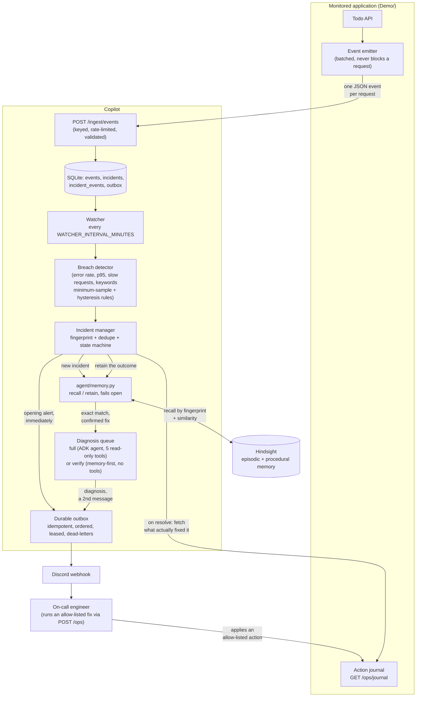
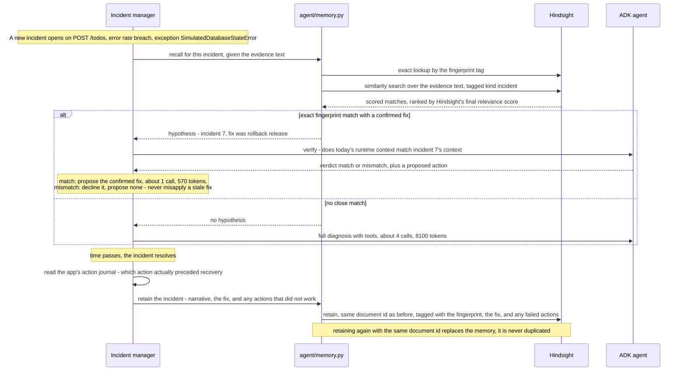

# Incident Response Agent

An on-call agent that watches a running application's telemetry, notices when something breaks, diagnoses it with
live evidence, and **remembers every incident it has handled** — so a repeat of the same problem costs one short
check instead of a full investigation, and a *different* problem that merely looks the same is never mistaken for
one memory already solved. Built on Google ADK, with [Hindsight](https://github.com/vectorize-io/hindsight) as the
memory layer.

> **Status.** Ingest, detection, the incident lifecycle, and Hindsight memory (recall, retain, the memory-first fast
> path) are built, unit tested, and verified against the real running stack — see [§6](#6-what-is-verified-and-what-is-not).
> A dedicated incident/memory UI is not built yet; the system is inspected through its API, its Discord alerts, and
> Hindsight's own UI. See [`docs/DESIGN.md`](docs/DESIGN.md) for the full design and [`docs/OPEN_DEFECTS.md`](docs/OPEN_DEFECTS.md)
> for everything still open.

## Contents
1. [The problem, in one scene](#1-the-problem-in-one-scene)
2. [Architecture](#2-architecture)
3. [How Hindsight is used](#3-how-hindsight-is-used)
4. [Run it](#4-run-it)
5. [Tests](#5-tests)
6. [What is verified, and what is not](#6-what-is-verified-and-what-is-not)
7. [Documents](#7-documents)

## 1. The problem, in one scene

It's 3 a.m. A service starts erroring. The on-call engineer spends the first twenty minutes working out *where* to
look, not fixing anything — and half the time, the answer was already known from a past incident that nobody wrote
down anywhere a machine could search.

This agent takes over the "where to look" part, remembers what it learns, and knows the difference between "I've
seen this exact thing before" and "this only *looks* like something I've seen before."

## 2. Architecture

Three containers: the monitored application (`Demo/`, a small Todo API with five injectable failure causes), the
Copilot (`Copilot/`), and [Hindsight](https://github.com/vectorize-io/hindsight) (memory). No observability stack to
run — applications push one event per request over plain HTTP.



**Detect → dedupe.** The watcher runs the same five read-only tools the agent uses (`get_error_rate`, `get_latency`,
`get_recent_logs`, `get_slow_requests`, `get_service_health`) and turns threshold breaches into a **fingerprint**:
`(service, breach kind, route, exception type)` — deliberately coarse, deliberately excluding volatile numbers, so
the same underlying problem keeps the same identity across watcher cycles and across days. A breach matching an
*active* incident's fingerprint is attached to it, not paged again. A breach matching a *recently resolved*
incident's fingerprint opens a **new** incident linked by `recurrence_of` — that link is what memory attaches to.

**Diagnose.** A brand-new fingerprint gets a full diagnosis: the ADK agent, with tools, reasoning about live
evidence. A fingerprint that memory recognises with a *confirmed* past fix takes the cheaper **verify** path instead
— see [§3](#3-how-hindsight-is-used). Either way, diagnosis happens off the detection path (a queue, with a per-run
model-call cap, an hourly cap, a daily token budget and a circuit breaker), so a slow or rate-limited model never
delays the page.

**Notify.** The opening alert goes out immediately from the breach evidence — it never waits on the LLM. The
diagnosis follows as a second message, only if the incident is still open. Delivery is a durable outbox: idempotent
per event, ordered per incident (a `resolved` message can never overtake its `opened` message), leased so a crashed
sender doesn't lose an alert, dead-lettered after repeated failures.

**Remediate and learn.** A human decides and runs a fix through the demo app's own `/ops/{action}` endpoint (one of
a fixed allow-list — the model can *propose* an action name, but only the server-validated allow-list can ever run).
When the incident resolves, the Copilot reads the app's **action journal** — a plain list of what was actually
applied, and when — to work out which action was the one that actually worked and which earlier ones did not. That,
not an approval UI, is how the system learns what fixed something.

## 3. How Hindsight is used

Hindsight is the memory layer, used for both **episodic** memory (what happened, incident by incident) and
**procedural** memory (which fix worked for which kind of problem). Everything below is code in
[`Copilot/agent/memory.py`](Copilot/agent/memory.py); the exact call shapes are also documented (with measured
latencies) in [`docs/DESIGN.md` §14](docs/DESIGN.md).



**Retain (episodic + procedural, on resolve).** One Hindsight document per incident, keyed by the incident id (so a
correction later *replaces* the memory, never duplicates it), tagged with the fingerprint, the confirmed
`fix:<action>`, and any `failed:<action>` — actions that were tried and did **not** work. That's negative memory:
the system remembers what *didn't* fix something, not only what did.

**Recall (before diagnosing).** Two calls: an exact lookup by fingerprint tag (`tags_match="any_strict"`), and a
similarity search over the evidence text for cases that merely look related. Results are filtered on Hindsight's
**final** relevance score, not the semantic-similarity score alone — in testing, an unrelated query still scored
0.34–0.46 on semantic similarity but ~0.00001 on the final score, so final score is what actually separates a real
match from noise.

**Recalled memory is a hypothesis, never a fact.** A recalled incident and its fix are handed to a light,
tool-less verification step that compares *today's* runtime context against what was recorded before. This is the
part that has to work for memory to be trustworthy rather than dangerous: two faults can produce the *identical*
error text and status code for different real reasons (in the demo, a bad deploy and a bad configuration value both
raise the same exception — only the release/config-revision context tells them apart). Live-tested result, in order:

| Occurrence | Path | Model calls | Tokens | Outcome |
|---|---|---|---|---|
| 1st time seeing this problem | full diagnosis | 4 | 8,101 | diagnosed from evidence (first guess was wrong; the real fix was found by trying) |
| Same problem again | **memory-first verify** | **1** | **566** | recalled the confirmed fix, context matched, proposed it — **14× fewer tokens** |
| Same *symptom*, different *real cause* (a decoy) | verify | 1 | 660 | recalled the fix, context did **not** match, verdict **mismatch**, proposed **none** rather than misapplying it |

Full run and the exact Hindsight-stored text: [`docs/DESIGN.md` §16](docs/DESIGN.md).

**Fails open, always.** If Hindsight is unreachable, slow, or `MEMORY_MODE=off`, recall returns nothing and retain is
skipped — the incident still gets a full diagnosis and still alerts. Memory is a cost-and-quality optimisation, never
a dependency the alert pipeline can be blocked by.

**Known limitation.** When verify returns `mismatch`, the incident does **not** currently escalate automatically to a
full diagnosis — it stays open with no proposed action until a person or an automated full run handles it. This is a
deliberate fail-safe (it will not misapply a memorized fix) but it is an honest gap; see `docs/OPEN_DEFECTS.md` (O18).

## 4. Run it

Prerequisite: Docker Desktop, and an LLM key (any [LiteLLM](https://docs.litellm.ai/)-supported provider — Groq's
`openai/gpt-oss-120b` is what this was built and tested against; see `docs/DESIGN.md` §14–15 for free-tier limits).

```bash
cp .env.example .env
# fill in INGEST_KEY, CHAOS_KEY, OPS_KEY (each: openssl rand -hex 24), AGENT_MODEL + its API key,
# and HINDSIGHT_LLM_API_KEY (Hindsight uses its own LLM call for memory extraction — a separate quota)
docker compose up -d --build
```

- Demo app: http://127.0.0.1:8000 (Todo UI) · Copilot API: http://127.0.0.1:8001 · Hindsight UI: http://127.0.0.1:9999
- All ports are bound to localhost only. The Copilot chat endpoints have no auth yet (`docs/OPEN_DEFECTS.md`), so
  don't expose it beyond your machine.

Break something and watch the whole loop, twice, to see memory in action:

```bash
# 1st time: full diagnosis
curl -X POST "http://127.0.0.1:8000/chaos/bad_deploy/post_todos?enabled=true" -H "X-Api-Key: $CHAOS_KEY"
#   generate traffic, watch: docker compose logs -f copilot   ("Incident INC-... opened ...")
curl -X POST http://127.0.0.1:8000/ops/rollback_release -H "X-Api-Key: $OPS_KEY"   # the right fix
#   wait for it to auto-resolve (RECOVERY_WINDOWS healthy windows), then:
curl -X POST http://127.0.0.1:8000/chaos/reset -H "X-Api-Key: $CHAOS_KEY"

# 2nd time: same fault -> memory-first verify, far fewer tokens, the confirmed fix proposed
curl -X POST "http://127.0.0.1:8000/chaos/bad_deploy/post_todos?enabled=true" -H "X-Api-Key: $CHAOS_KEY"
```

Inspect what memory holds directly in Hindsight's UI at http://127.0.0.1:9999, or query the Copilot's SQLite via
`docker compose exec copilot python -c "from db import incidents; ..."`.

## 5. Tests

No local Python needed; the suites run in a container:

```bash
docker run --rm -v "$PWD/Demo:/w" -w /w python:3.13-slim sh -c \
  "pip install -q fastapi==0.115.0 -r requirements-dev.txt && python -m pytest -q"
docker run --rm -v "$PWD/Copilot:/w" -w /w python:3.13-slim sh -c \
  "pip install -q fastapi pydantic python-dotenv -r requirements-dev.txt && python -m pytest -q"
```

387 tests total (118 Demo, 269 Copilot) as of this write-up. CI (`.github/workflows/ci.yml`) runs both suites plus
repository hygiene checks on every push.

## 6. What is verified, and what is not

- **Unit tested:** ingest validation and limits, the SQL-backed tools, breach detection and hysteresis, the incident
  state machine (including concurrent-operator conflicts), the durable outbox (ordering, leases, dead-letters), the
  diagnosis budget and circuit breaker, Hindsight recall/retain/fail-open behaviour, and the memory-first routing —
  269 Copilot tests, 118 Demo tests, all passing; 14/14 deliberately injected bugs caught by the suite.
- **Live-tested against the real 3-service stack**, with two independent tester rounds (one functional, one
  security-focused — see `docs/TESTER_BRIEFS.md`) and this session's own end-to-end run with real Groq calls and
  real Hindsight retain/recall (`docs/DESIGN.md` §15–16).
- **Not yet built:** a dedicated incident/memory UI, chat-endpoint authentication, auto-escalation on a verified
  memory mismatch, and a formal multi-seed benchmark (the numbers above are one measured live run, not an average).
  Full list, with severity and owner: [`docs/OPEN_DEFECTS.md`](docs/OPEN_DEFECTS.md).

## 7. Documents

| File | What |
|---|---|
| [`docs/DESIGN.md`](docs/DESIGN.md) | Full architecture, memory design, security model, edge cases, acceptance criteria, and the measured results from every milestone |
| [`docs/TEST_LOG.md`](docs/TEST_LOG.md) | What was verified live, by whom, and with what confidence |
| [`docs/OPEN_DEFECTS.md`](docs/OPEN_DEFECTS.md) | Every open defect, limitation and carried-forward item, with severity |
| [`docs/KNOWN_LIMITATIONS.md`](docs/KNOWN_LIMITATIONS.md) | Accepted trade-offs |
| [`docs/TESTER_BRIEFS.md`](docs/TESTER_BRIEFS.md) | Scenario briefs used in the independent testing rounds |
| [`docs/KICKOFF_INSIGHTS.md`](docs/KICKOFF_INSIGHTS.md) | Ideas from the team kickoff discussion and what became of each |
| [`spike/`](spike) | Local Hindsight setup and the scripts that measured its behaviour and the LLM gate |
